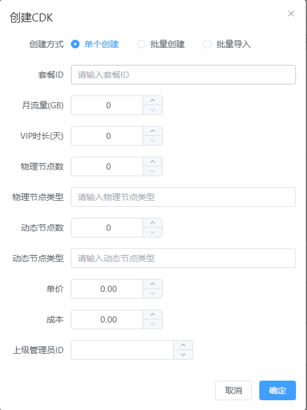
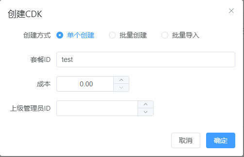

# CDK 管理使用指南

本指南详细介绍了 SUI-Ops 总控后台中 CDK 的创建、批量管理、以及其在分润体系与资源分配中的核心作用。

---

## 1. CDK 创建与管理步骤

请登录 SUI-Ops 总控后台，进入 **[CDK 管理]** 页面进行操作。

### 灵活的创建模式
在创建 CDK 时，您有两种核心方式：
* **关联套餐模式**：直接输入 **[套餐 ID]**，系统将自动读取您在 [套餐配置](plan-config.md) 中预设的流量、时长及节点权限，实现极速创建（参考 `cdk管理-关联套餐预设.png`）。
* **自定义模式**：若不填套餐 ID，可根据需要灵活手动填写各项参数，实现千变万化的产品定制（参考 `cdk管理-自定义.png`）：
  * **流量/时长**：自定义 CDK 包含的月流量配额与 VIP 服务时长。
  * **节点分配**：可分别指定物理节点数（固定节点）与动态节点数，并配合对应的节点类型标签进行精准分配。
  * **成本与单价**：管理员可填写成本与单价，方便系统自动统计利润，实现清晰的财务管控。
  * **上级管理员 ID**：**核心分润锚点**。若用户未绑定过上级，初次使用该 CDK 时，系统会自动将该用户归属至对应的管理员名下，后续该用户的消费行为将自动触发级差提成。

### 管理与追踪
* **批量导入/导出**：支持按行文本导入现成 CDK 码，或将系统生成的 CDK 数据一键导出，方便分发给卡盟或线下代理。
* **状态追踪**：列表实时显示 CDK 的使用状态（已使用/未使用）、激活时间以及使用者账号，确保每一份资源都可溯源。

---

## 2. CDK 激活时的资源调度与分配机制

当用户激活 CDK 时，系统会自动执行以下自动化流程：

### 节点分配策略
* **固定节点（自动绑定）**：
  * 系统根据套餐定义的“物理节点数”，从对应的 [VPS 类型] 资源池中自动挑选并绑定节点。
  * 无论固定还是动态，若节点处于中转模式，系统均通过监控中转机的负载来决定是否允许接入。
* **动态节点（实时调度）**：
  * 动态节点不占用 CDK 初始分配的“物理节点数”名额，激活即获得该类型资源池的访问权限。用户使用时，系统自动调度负载最低vps下的所有节点。
* **分配异常处理**：
  * 若固定节点资源池名额已满，系统将无法自动分配。此时需管理员在用户管理界面手动干预。

### ⚠️ 特别注意
* **覆盖逻辑**：若用户升级不同类型套餐，系统将执行“覆盖”策略，旧的节点绑定关系将被清除，并根据新套餐重新触发自动分配。
* **防分配隔离**：若某台节点不希望被自动分配（仅供测试），请确保其 [VPS 类型] 标签未被任何在售套餐选中。

---

## 3. 高级代理与级差提成逻辑

为了激励代理分销，系统内置了严密的级差提成逻辑，在 CDK 激活时自动完成结算：

### 级差提成规则
系统会递归向上查找管理员链。只有当上级管理员的提成比例高于下级时，才会产生差额利润并自动计入账目：
* **示例**：若上级提成比例为 60%，下级为 40%。当下级渠道的 CDK 被激活时，上级自动获得 20% 的差额提成。
* **无效提成**：若上下级无差额（即比例相同或下级更高），则上级不产生提成。

### 支付回调自动创建
在用户通过第三方支付成功付款时：
1. 总控会自动向上查找可用的 CDK 进行扣减。
2. 若上级库存不足，系统会根据套餐配置**自动创建并消耗新 CDK**，确保分销业务链路 24 小时不断档。

---
