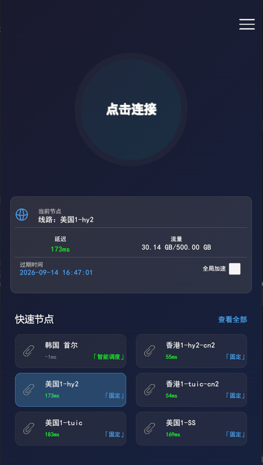
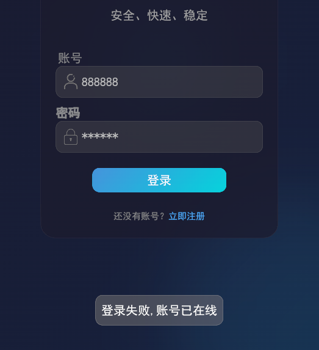
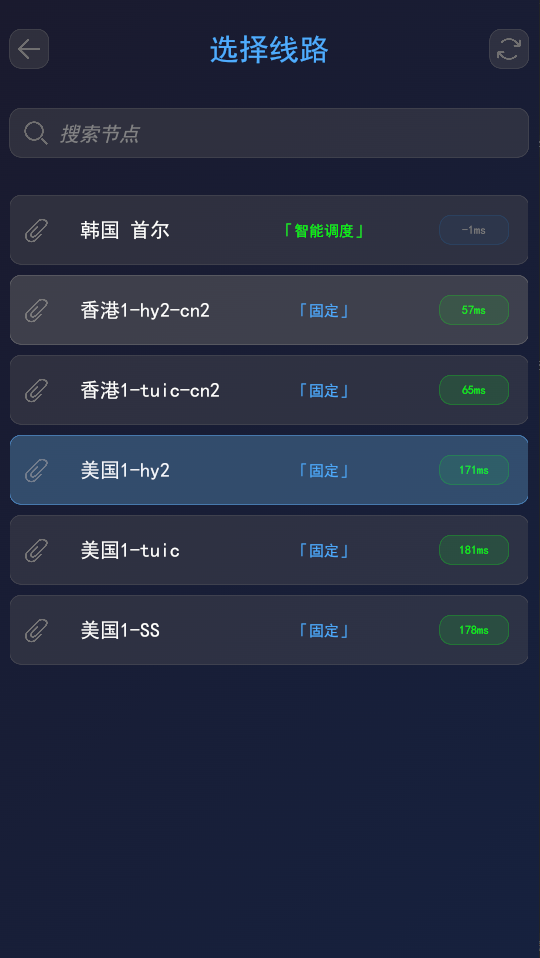
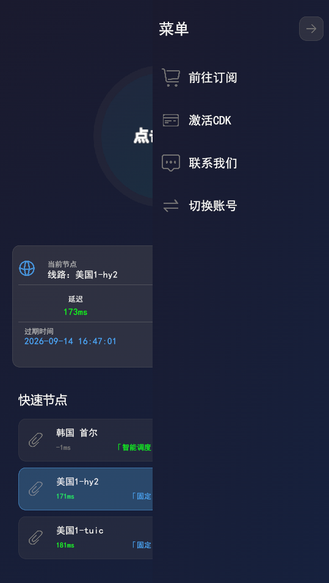

# 客户端生态（自研 Unity 跨平台 + 多端安全控制）

SUI-Ops 为您交付的不止是强大的后端总控，更包 基于 Unity 引擎深度集成的跨平台高端客户端。我们从“极致视觉、安全、防白嫖损耗”三大维度出发，助您打造无可挑剔的用户品牌形象。

---

## 🎨 1. 自研 Unity 跨平台核心

- **双端全重构交付**：同时支持 Windows 与 Android 端，基于 Unity 3D 引擎跨平台集成，UI 交互流畅度与视觉表现力远超传统套壳客户端。
- **顶配内核驱动**：底层集成高性能 sing-box 核心，确保极致转发性能与协议兼容性。

---

## 🔒 2. 安全机制（全内存级运行）

- **核心数据绝不落地**：所有节点配置、订阅信息完全在运行内存（RAM）中动态加载。
- **物理绝缘防探测**：本地磁盘绝不生成任何 `config.json` 或明文配置文件。即使磁盘被读取，也无法获取任何节点明文信息，从根本上提升同行探测您宝贵节点配置的难度。

---

## 🚫 3. 单账号排他性唯一登录（精准防合租）

- **后端动态会话锁死**：系统通过后端进行严格的动态会话唯一性绑定。每个账号在同一时间仅允许存在一个合法的活跃登录态。
- **“一登一卡”排他拦截**：如果该账号已在设备 A 上处于连接状态，设备 B 在未主动断开设备 A 的前提下，无法强行登录或建立新连接。
- **商业价值**：彻底杜绝“合租/多端分享”带来的利润流失，将“有效用户”转化率逼向最大值。

---

## 🍏 4. 全生态网络包容（完美兼容 iOS / 开源生态）

- **免除 App Store 上架烦恼**：针对高净值 iOS 用户，系统前端门户提供**一键获取原生 s-ui 标准订阅链接**的功能，无需将客户端上架 App Store。
- **全开源生态无缝导入**：该标准订阅链接不仅支持 iOS 端的 sing-box、Shadowrocket 等客户端，更可完美兼容 **Clash（Windows/Mac）、v2rayN**，以及 **OpenWrt（OpenClash/PassWall）、iStoreOS** 等软路由系统。
- **数据完全一致性**：无论用户使用何种生态端，其消耗的流量与到期时间均实时同步至总控后台，计费逻辑依然精准统一。

---

## ⚡ 5. 「智能调度」与「固定」双场景模式（客户端一键切换）

您的用户在客户端一键切换模式，即可适配所有业务需求：

### A. 智能调度模式（动态负载均衡）
- **区域化聚合显示**：物理节点被自动归纳为“国家/城市”等区域标签（如“韩国 首尔”），用户无需面对冗长的节点列表。
- **实时动态分配**：用户点击区域时，系统实时从后端资源池中筛选在线人数最低的节点。
- **无感故障迁移**：客户端无需刷新，若节点发生故障，系统自动路由至可用节点，实现“即点即用”。
- **设计初衷**：牺牲用户的“节点选择自由权”，换取全局动态池资源利用率，彻底消灭因用户集中涌入热门节点导致的资源损耗。

### B. 固定模式（IP 稳定性保障）
- **精确绑定**：激活时系统即为用户绑定专属的物理节点名额，出口 IP 地址固定，不参与实时调度。
- **适用场景**：满足 ChatGPT/Claude 长期登录、跨境电商账号风控、远程办公等对出口 IP 一致性有严苛要求的业务。

---

## 🧭 6. 多维聚合菜单与高准度看板

- **【前往订阅】**：点击后唤醒系统默认浏览器，跳转至对应官网门户。用户可在网页端完成 USDT 充值对账、多支付渠道切换等操作，客户端保持极致轻量化。
- **【联系我们】**：点击后跳转至自定义客服链接。若用户归属的上级管理员设置了专属客服链接，则优先跳转该链接，否则使用系统全局兜底链接。

---

## 🖼️ 客户端界面预览

*主界面 - 流量统计与快捷开关*

*单账号排他性登录拦截提示*

*智能调度区域聚合与固定节点选择*

*侧滑菜单 - 订阅与客服入口*

> **运营实操提示**：关于如何下发客户端安装包、配置 iOS 订阅链接、处理单在线客诉以及企业级软路由绕过等具体操作步骤，请参阅《[客户端使用与多端下发指南](client-guide.md)》。