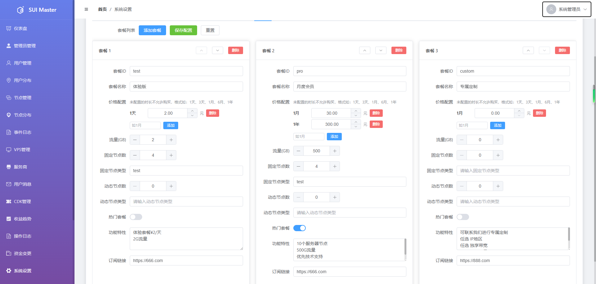
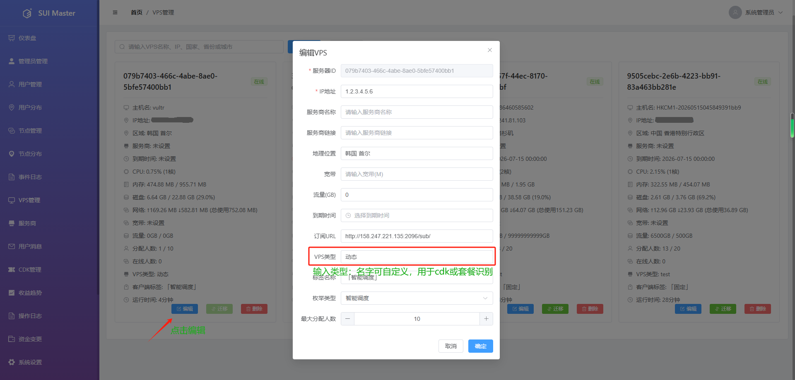

# 套餐配置教程

本指南详细介绍了如何在 SUI-Ops 总控后台配置套餐，利用自定义节点类型实现精细化的资源池分配与自动结算。

---

## 1. 套餐配置步骤

登录总控后台，进入 **[系统设置] -> [套餐配置]**。配置时，请重点关注以下核心逻辑：

* **套餐id**：不可重复
* **套餐名称**：输入套餐标题。（系统将自动同步至门户网站，无需人工介入）。
* **节点vps类型匹配（核心逻辑）**：
  * **节点类型（固定/动态）**：此处并非只能填“固定”或“动态”，而是**支持自定义类型**（例如：`固定1`、`固定2`、`CN2-专线` 等）。
  * **匹配机制**：系统发放 CDK 时，会严格依据此处设置的类型，在对应的 VPS 资源池中进行自动筛选和分配。
  * **分配差异**：
    * **固定类型**：激活时立即锁定物理节点名额。若资源不足，系统将分配失败。
    * **动态类型**：激活时不锁定单一物理节点，而是赋予用户对该类型池的“实时访问权限”。用户在连接时，系统根据当前动态节点池的负载情况，自动为用户分配负载最低的vps。
  * **运营建议**：通过给不同等级套餐设置不同的节点类型（如“普通会员”对应“固定1”，“高级会员”对应“固定2”），您可以实现不同等级用户对不同物理节点的逻辑隔离，动态也是同理。
* **物理节点数（可见 VPS 限制）**：
  * 该参数设定用户有权接入的**物理 VPS 实例总数**。例如，设置为 3，则用户在使用cdk时会自动分配 3 个物理vps的节点。
  * 注意：如果没有足够的资源分配，固定类型的后续将不会再次为用户补充,动态类型会自己处理。如没有给用户分配足够的固定节点，用户投诉，需要在用户管理界面手动添加节点
* **订阅链接（支付逻辑开关）**：
  * **内嵌支付模式**：若订阅链接域名与门户网站一致（如 `https://666.com`），系统调用内置 API 处理订单。
  * **外部跳转模式**：若域名不一致，系统将作为外链引导至您指定的第三方支付页面（如发卡平台）。  
    **参数传递**：跳转时，系统会自动在 URL 后附加 `account`（当前登录用户名）和 `planId`（套餐ID）参数，以便第三方平台识别用户身份和所选套餐。  
    示例：`https://example.com/buy?account=testuser&planId=basic`

---

## 2. 流量结算与时间起算逻辑

* **起算时间**：VIP 时长及计费周期严格从用户激活 CDK 的当天开始起算。
* **自动续费顺延**：套餐到期后，续费将自动在原到期时间基础上累加时长（如月付套餐自动 +30 天）。
* **权限割接（到期/超额）**：当满足以下任意条件时，系统毫秒级阻断账号权限：
  1. 超过 VIP 有效期绝对时长。
  2. 实时已用流量超出套餐总配额。

---

## 3. 套餐续费与升级覆盖规则

* **同套餐续费**：直接在原有到期时间上进行时长累加。
* **覆盖式升级（不同套餐）**：若用户在存续期内激活了其他套餐，系统将以新套餐的规则（时长/流量/节点类型权限）**直接覆盖**旧套餐。
* **流量加油包**：若时长未到期但流量耗尽，激活加油包可**重置已用流量至 0**，恢复满额可用状态，且不改变原到期时间。

---

### 运营者特别提醒：资源匹配与 CDK 分配
在编辑 VPS 节点时，请务必确保该节点的 **[VPS类型]** 标签与套餐中配置的类型完全一致。**系统是通过这个标签作为“钥匙”去匹配节点池的**，配置错误会导致 CDK 发放后无法分配到对应的 VPS 节点。

