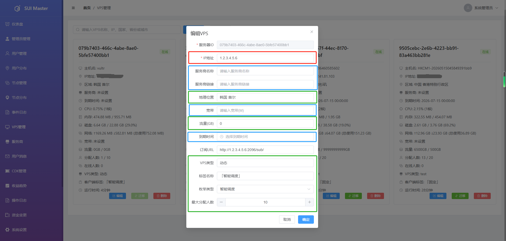

# VPS 管理使用指南

本指南详细介绍了 SUI-Ops 总控后台中 VPS 的管理、配置逻辑以及资源分配规则。

> **部署前置说明**：若您已完成 [系统部署指南](deployment.md) 中的节点安装，安装成功的子节点 VPS 将会自动注册并显示在当前的“VPS管理”页面中。此页面即为 [系统部署指南](deployment.md) 中提到的“后台配置节点”管理中心，您可以在此完成节点的最终商业化定价与权限配置。

通过合理的 VPS 配置，您可以精确控制不同类型用户的 VPS 访问权限与负载分配。

---

## 1. VPS 编辑与配置详解

在 **[VPS管理]** 页面点击“编辑”按钮，即可对vps进行参数配置。请参考 `vps管理.png`，了解各项参数的功能划分：

### 核心参数说明

* **核心基础参数 (禁止修改)**：
    * **IP 地址**：vps的网络标识。此项为系统核心数据，**严禁修改**，以免导致vps通讯中断或数据统计异常。
* **资源调度与分配 (核心配置)**：
    * **地理位置**：vps的物理归属地，用于用户识别vps特征。
    * **流量 (GB)**：vps的“最大分配流量”。**仅对固定类型 VPS 有效**，用于容量规划（例如：若vps总容量为 1000GB，用户套餐为 500GB，则该vps最多可分配给 2 个固定用户）。动态节点不依赖流量进行预分配。
    * **VPS 类型**：CDK 与套餐分配**固定节点**时的关键识别依据。请确保此处填写的类型与套餐配置中的标签完全一致。
    * **标签名称**：**客户端显示标签**。修改此处，用户前端客户端看到的vps标签将实时同步更新。
    * **枚举类型**：定义vps的性质：
        * **智能调度**：动态 VPS。**采用房间制实时分配，不预绑定用户**。用户连接时由系统自动选择当前最空闲的节点，断开后立即释放资源。最大在线人数由下方的“最大分配人数”字段控制，该字段在此类型下实际表示**最大在线人数**。
        * **固定/运营/专属/无**：均属于固定类型 VPS。分配给用户后，在该用户有效期内，该 VPS 被用户“持有”，并占用一个分配名额。
    * **最大分配人数**：
        * 对于**固定类型 VPS**：CDK 发放时的**首选优先级参数**。系统优先依据该数值判断 VPS 是否满员；若未设置人数，则系统自动切换为依据“流量”配额进行分配。
        * 对于**智能调度 (动态) VPS**：此处代表该 VPS 允许的**最大在线人数**。动态节点不参与 CDK 的预分配，因此该字段不影响 CDK 分配流程，仅用于实时负载计算与扩缩容决策。
* **管理辅助信息 (可任意修改)**：
    * 此区域包含“服务商名称”、“服务商链接”、“带宽”、“到期时间”等信息，仅作为管理员查看的备注，不影响系统的底层业务逻辑。

---

## 2. CDK 分配与优先级逻辑

系统在执行 CDK 使用或套餐自动分配时，**仅针对固定类型节点**遵循以下逻辑（动态节点不参与 CDK 分配，由客户端实时接入）：

* **分配依据**：仅根据 VPS 的“最大分配人数”判断是否满员。未设置最大分配人数的 VPS 将无法被 CDK 分配流程选中。

> **动态节点说明**：动态节点（智能调度）不再通过 CDK 预先绑定用户。系统根据用户套餐中的动态节点权限，允许用户在客户端选择“智能调度”标签，由房间制动配系统实时分配当前最空闲的动态 VPS。因此，动态节点的容量（最大在线人数）与 CDK 分配逻辑完全解耦。

---

### 💡 运营专家提示

* **一致性原则**：为了确保 CDK 能正确给用户分配**固定节点**，请务必保持此处设置的 **[VPS 类型]** 与您在 **[套餐配置]** 中填写的名称完全一致。
* **标签管理**：[标签名称] 是您的品牌化工具，您可以根据vps的实际用途（如“高速专线”、“稳定固定”）灵活调整，以提升用户的购买体验。
* **动态节点利用率**：得益于房间制分配，动态节点的资源利用率可达近乎 100%，无需预留离线用户，极大降低运营成本。